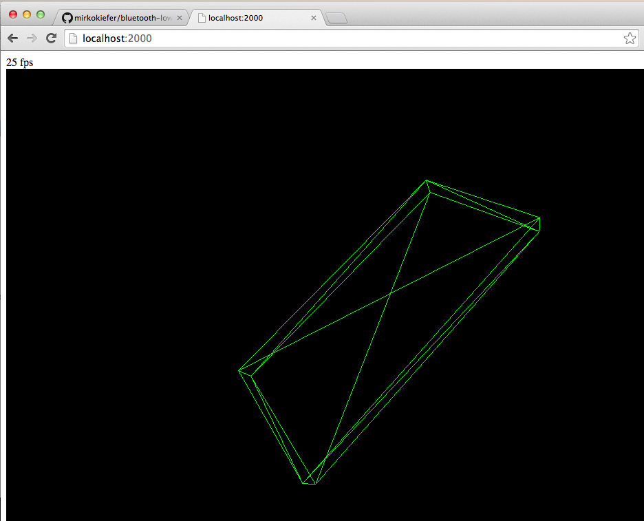

#Bluetooth Low Energy Demo
A demo app using Bluetooth Low Energy to stream an iPhone's attitude to a 3D wireframe in the browser.

Slides to the talk:
- [Intro to Bluetooth Low Energy](http://www.slideshare.net/mirkokiefer/bluetooth-36199949)

The tools I used:
- iPhone gyrometer
- [CoreBluetooth framework](https://developer.apple.com/library/ios/documentation/NetworkingInternetWeb/Conceptual/CoreBluetooth_concepts/AboutCoreBluetooth/Introduction.html#//apple_ref/doc/uid/TP40013257) on the iPhone
- [noble](https://github.com/sandeepmistry/noble) (BLE libray for node.js)
- Websockets to live stream data to the browser
- [three.js](http://threejs.org/) for the 3D rendering

